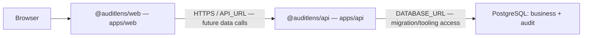
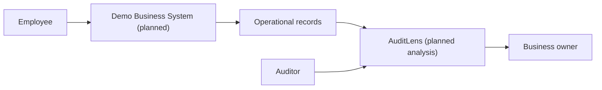
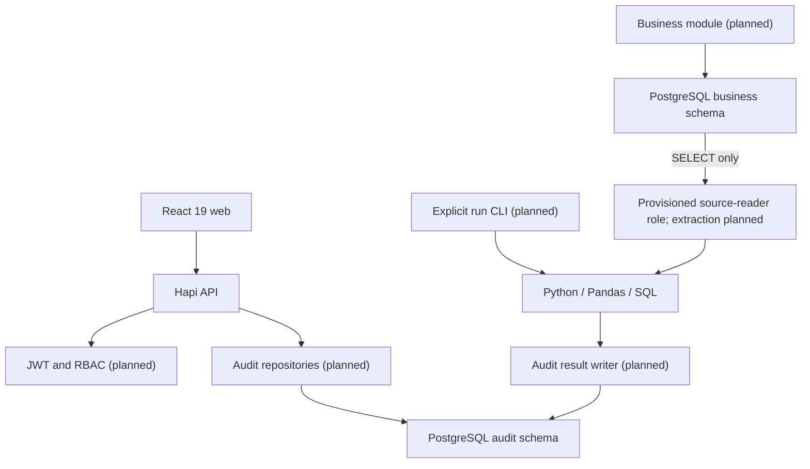
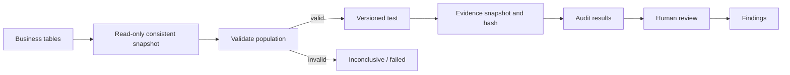
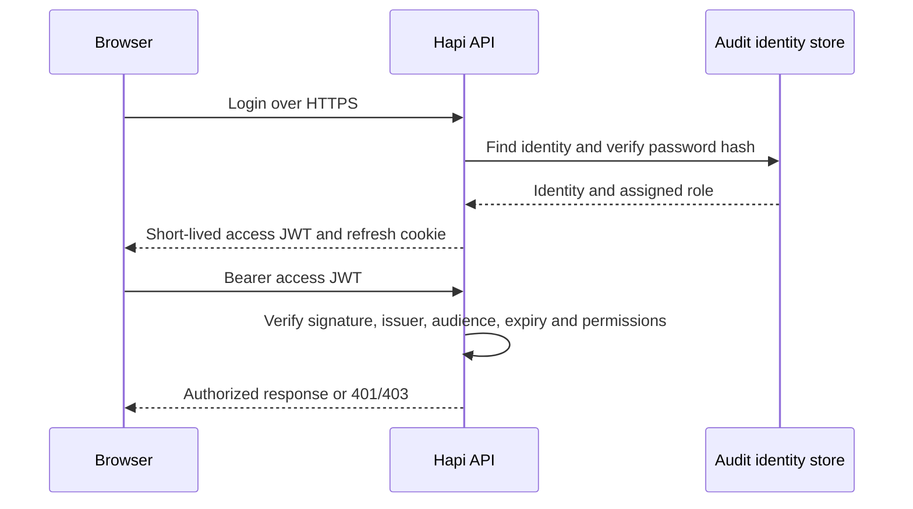
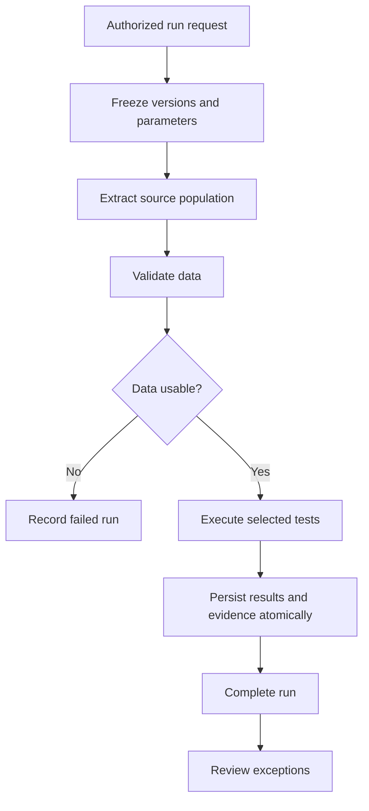

# System architecture

Diagrams describe the target architecture unless labeled current. Phase 0 implemented the web shell, API health, schema boundaries and engine health CLI. Phase 1 adds business domain migrations, deterministic synthetic generation and fixture QA; disposable local PostgreSQL runtime acceptance now passes (see VERIFICATION.md).

The developer reports PostgreSQL connectivity and migrations working: **REPORTED AS WORKING**, not independently executed here. The [verification record](VERIFICATION.md) separates current local acceptance from unverified remote settings; the review is historical.

## Current repository and deployment boundaries

apps/api owns Hapi source and apps/api/database (Knex configuration, migrations, generators, seeds, validation and sample-data). Root scripts and tests orchestrate cross-component verification. audit-engine remains an independent Python package; docs remains repository documentation. Root npm workspaces delegate web/API development and web builds; root database commands point into API-owned tooling.

Separate Railway services are an explicit requirement and REPORTED AS WORKING. No page currently invokes apiFetch; health is database-free. API start runs migrations before the server. Python is not a deployed service. Railway watch paths and service settings are not checked into the repository and have not been inspected remotely. See [deployment](DEPLOYMENT.md) and [ADR-007](adr/ADR-007-api-database-and-independent-deployment.md).

## Database identities

CURRENT: DATABASE_URL is the migration/admin identity also used by API startup. Explicit administration provisions auditlens_source_reader as a non-owner NOLOGIN permission group with business SELECT only. Acceptance authenticates a separate unprivileged test login and SET ROLE. No reader credential is needed for API health or Web. PLANNED: extraction login, least-privilege API runtime and a separate audit result writer. No audit-engine deployment, extraction or result tables exist. See [ADR-008](adr/ADR-008-database-privilege-separation.md) for PUBLIC/default-grant treatment and [verification](VERIFICATION.md) for runtime evidence.

## 1. System context

Employees generate source activity. AuditLens independently analyzes it. Auditors review conclusions and owners respond to findings.

## 2. Containers and components

The web is a Vite application. Hapi provides a single API with separated modules. PostgreSQL hosts two schemas. Python handles tabular analysis. The source-reader permission role has explicit provisioning; the future extraction login and result writer will use distinct credentials; no source-writing capability belongs to the reader. No queue, cache or additional service is required in Phase 0.

## 3. Audit data flow

Snapshot metadata permits reproducibility. Hashes detect changes only when compared against a trusted value; database hashes alone do not make evidence tamper-proof. Raw sensitive fields should be minimized.

## 4. Authentication flow (planned)

Access tokens remain in memory. Refresh tokens will be rotated and stored hashed server-side. Refresh cookies require HttpOnly, Secure and SameSite plus origin/CSRF checks. No authentication is implemented yet.

## 5. Audit testing flow (planned)

Future run orchestration must enforce idempotency and bounded workloads. Tests return pass, exception or error, with population counts; they do not issue assurance opinions.

## Technology references
Implementation follows [Vite setup](https://vite.dev/guide/), [DaisyUI Vite integration](https://daisyui.com/docs/install/vite/) and [Hapi startup](https://hapi.dev/tutorials/en_us/getting-started). npm lockfiles capture installed versions.
