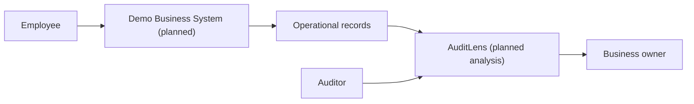
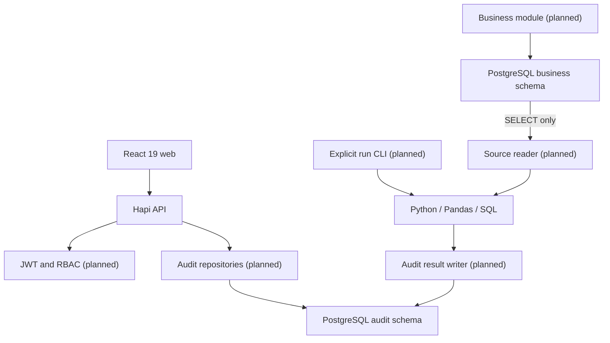
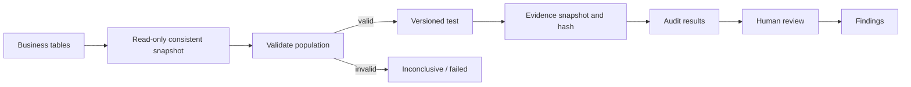
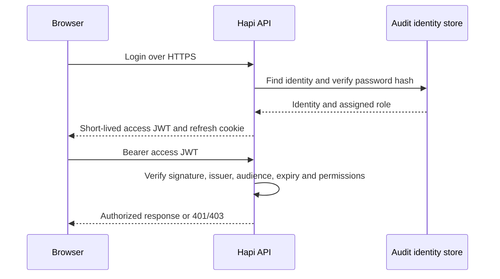
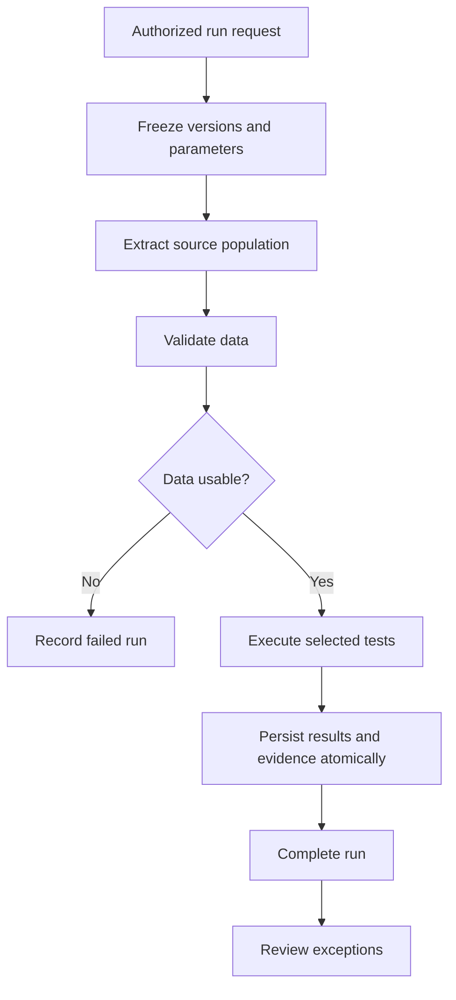

# System architecture

Diagrams describe the target architecture unless labeled current. Phase 0 implemented the web shell, API health, schema boundaries and engine health CLI. Phase 1 adds business domain migrations, deterministic synthetic generation and fixture QA; PostgreSQL runtime verification remains pending.

## 1. System context

Employees generate source activity. AuditLens independently analyzes it. Auditors review conclusions and owners respond to findings.

## 2. Containers and components

The web is a Vite application. Hapi provides a single API with separated modules. PostgreSQL hosts two schemas. Python handles tabular analysis. Reader and writer use different credentials; no source-writing capability belongs to the reader. No queue, cache or additional service is required in Phase 0.

## 3. Audit data flow

Snapshot metadata permits reproducibility. Hashes detect changes only when compared against a trusted value; database hashes alone do not make evidence tamper-proof. Raw sensitive fields should be minimized.

## 4. Authentication flow (planned)

Access tokens remain in memory. Refresh tokens will be rotated and stored hashed server-side. Refresh cookies require HttpOnly, Secure and SameSite plus origin/CSRF checks. No authentication is implemented yet.

## 5. Audit testing flow (planned)

Future run orchestration must enforce idempotency and bounded workloads. Tests return pass, exception or error, with population counts; they do not issue assurance opinions.

## Technology references
Implementation follows [Vite setup](https://vite.dev/guide/), [DaisyUI Vite integration](https://daisyui.com/docs/install/vite/) and [Hapi startup](https://hapi.dev/tutorials/en_us/getting-started). npm lockfiles capture installed versions.
