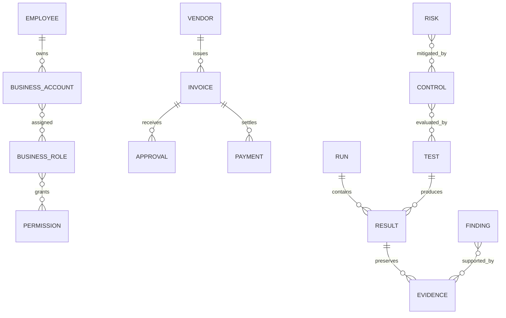
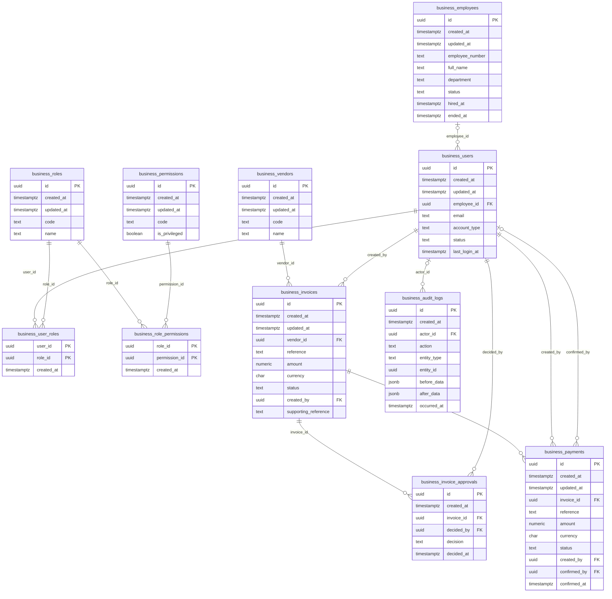
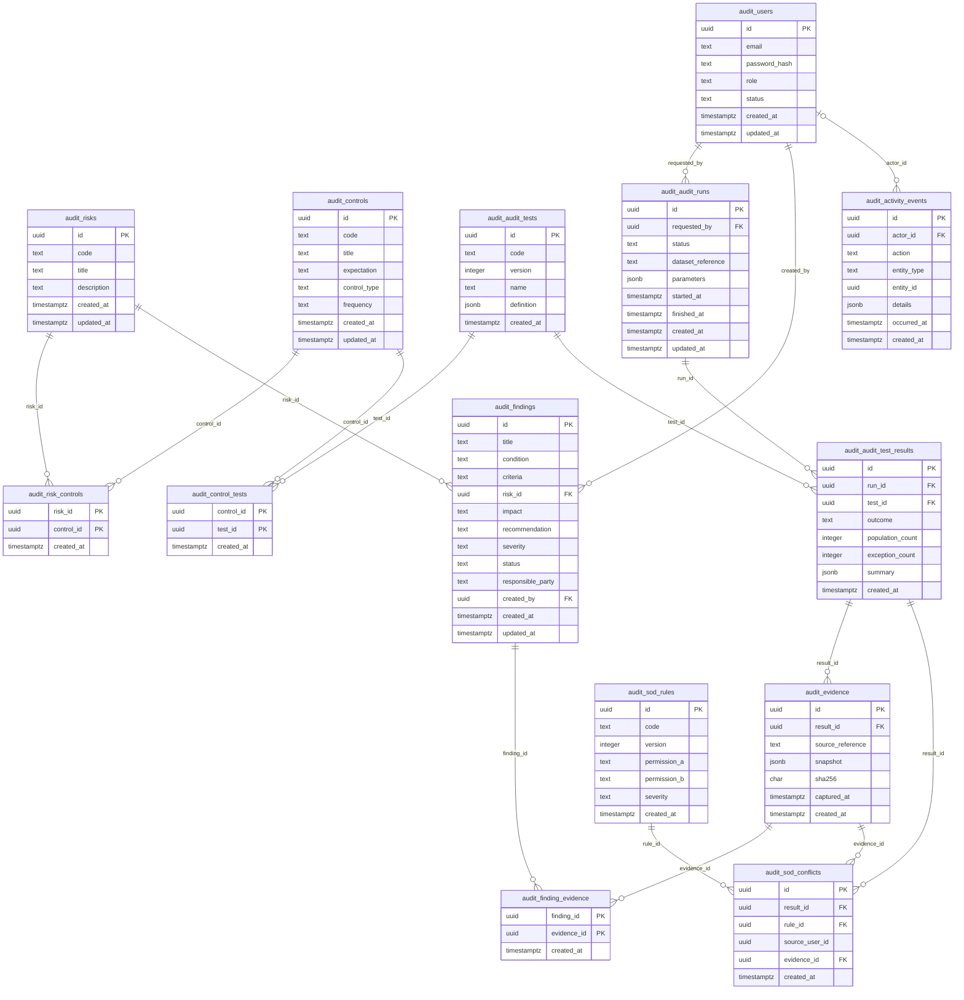

# Entity relationship design

**Business tables are IMPLEMENTED in the Phase 1 migration; audit tables remain PLANNED.** Disposable local PostgreSQL 17.5 migration, constraint and fixture acceptance passed; Railway runtime remains separately unverified. See [verification](VERIFICATION.md). Migration source is under apps/api/database/migrations. The design separates identity domains and preserves source evidence without cross-schema foreign keys.

## Conceptual ERD

## Logical ERD
Names prefixed business_ and audit_ represent their PostgreSQL schemas. Each FK line below is explained in the relationship inventory.

### A. Demo Business System — IMPLEMENTED IN PHASE 1

Migration implemented; runtime acceptance is recorded in VERIFICATION.md. Names use `business_` to represent the business schema.

### B. AuditLens — PLANNED

## Relationship inventory

- business.users.employee_id → business.employees: each child references zero or one parent; a parent can have zero or many children. Human owner; null for service accounts.
- business.user_roles.user_id → business.users: each child references exactly one parent; a parent can have zero or many children. Assigned account.
- business.user_roles.role_id → business.roles: each child references exactly one parent; a parent can have zero or many children. Assigned role.
- business.role_permissions.role_id → business.roles: each child references exactly one parent; a parent can have zero or many children. Role.
- business.role_permissions.permission_id → business.permissions: each child references exactly one parent; a parent can have zero or many children. Capability.
- business.invoices.vendor_id → business.vendors: each child references exactly one parent; a parent can have zero or many children. Supplier.
- business.invoices.created_by → business.users: each child references exactly one parent; a parent can have zero or many children. Creator.
- business.invoice_approvals.invoice_id → business.invoices: each child references exactly one parent; a parent can have zero or many children. Reviewed invoice.
- business.invoice_approvals.decided_by → business.users: each child references exactly one parent; a parent can have zero or many children. Decision maker.
- business.payments.invoice_id → business.invoices: each child references exactly one parent; a parent can have zero or many children. Paid invoice.
- business.payments.created_by → business.users: each child references exactly one parent; a parent can have zero or many children. Creator.
- business.payments.confirmed_by → business.users: each child references zero or one parent; a parent can have zero or many children. Confirmer.
- business.audit_logs.actor_id → business.users: each child references zero or one parent; a parent can have zero or many children. Actor; null for system event.
- audit.risk_controls.risk_id → audit.risks: each child references exactly one parent; a parent can have zero or many children. Mapped risk.
- audit.risk_controls.control_id → audit.controls: each child references exactly one parent; a parent can have zero or many children. Mapped control.
- audit.control_tests.control_id → audit.controls: each child references exactly one parent; a parent can have zero or many children. Control coverage.
- audit.control_tests.test_id → audit.audit_tests: each child references exactly one parent; a parent can have zero or many children. Versioned test.
- audit.audit_runs.requested_by → audit.users: each child references exactly one parent; a parent can have zero or many children. Requesting auditor.
- audit.audit_test_results.run_id → audit.audit_runs: each child references exactly one parent; a parent can have zero or many children. Execution parent.
- audit.audit_test_results.test_id → audit.audit_tests: each child references exactly one parent; a parent can have zero or many children. Exact test version.
- audit.evidence.result_id → audit.audit_test_results: each child references exactly one parent; a parent can have zero or many children. Origin test result.
- audit.findings.risk_id → audit.risks: each child references exactly one parent; a parent can have zero or many children. Primary risk.
- audit.findings.created_by → audit.users: each child references exactly one parent; a parent can have zero or many children. Author.
- audit.finding_evidence.finding_id → audit.findings: each child references exactly one parent; a parent can have zero or many children. Finding.
- audit.finding_evidence.evidence_id → audit.evidence: each child references exactly one parent; a parent can have zero or many children. Preserved evidence.
- audit.sod_conflicts.result_id → audit.audit_test_results: each child references exactly one parent; a parent can have zero or many children. Origin result.
- audit.sod_conflicts.rule_id → audit.sod_rules: each child references exactly one parent; a parent can have zero or many children. Exact rule version.
- audit.sod_conflicts.evidence_id → audit.evidence: each child references exactly one parent; a parent can have zero or many children. Supporting permission snapshot.
- audit.activity_events.actor_id → audit.users: each child references zero or one parent; a parent can have zero or many children. Platform actor.

## Normalization and responsibility decisions
Employees and users are separate because employment and access status differ; one employee can own multiple accounts. Vendors provide a stable duplicate-invoice grouping key. Role assignments and control coverage use junctions to avoid arrays and many-to-many duplication. One payment applies to one invoice in the initial proposed model; multiple partial payments are possible.

A generic transactions table is deferred: invoices and payments already represent distinct business events and a catch-all would blur validation. Business audit_logs record source activity, while audit.activity_events record platform activity. Source password/session design is deferred until authentication; audit.users is a distinct platform identity.

Evidence is a standalone snapshot entity because exceptions need evidence before a finding exists and multiple findings may cite the same evidence. finding_evidence is therefore a junction. sod_conflicts is a typed projection for explainable rule/user combinations, tied to evidence and results rather than a second independent truth. Validate evidence/result consistency before persistence.

Source references deliberately are not FKs: findings must survive source mutation/deletion. Reports will be derived views rather than a table until export retention requirements exist. The eleven business domain tables have migrations; audit domain tables remain planned.
