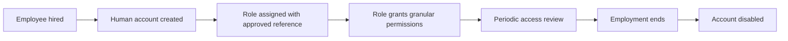
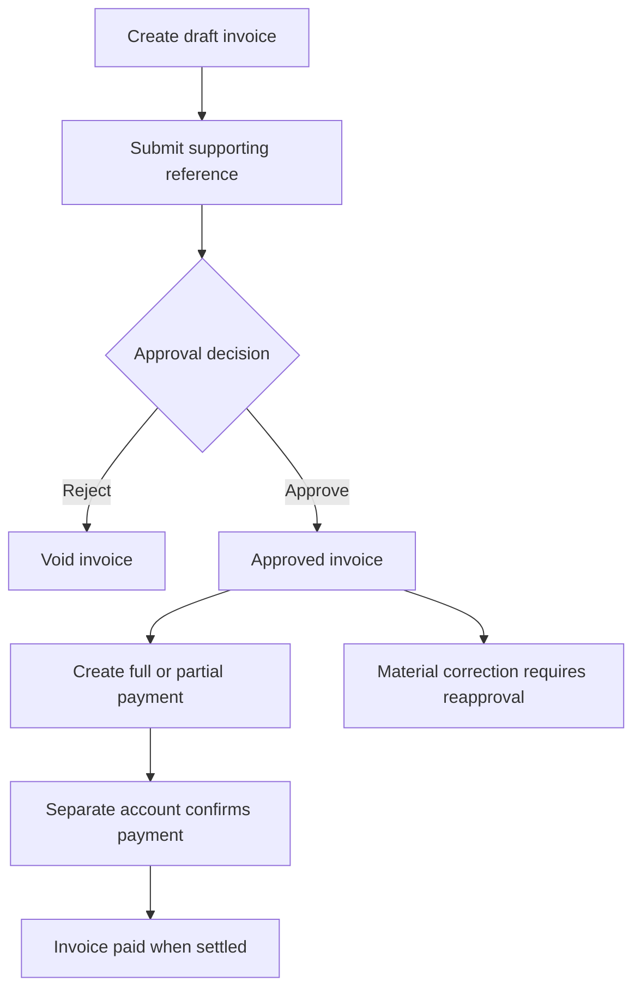

# Simulated business process

These workflows and controls are **AuditLens project-defined examples**, not authoritative professional audit standards. All employees, suppliers, references and events are fictional. The generator materializes the process; interactive business workflows and enforcement are not implemented.

## User access lifecycle

The employees table owns employment dates/status. users owns independent account status and last successful login. user_roles grants roles; role_permissions grants capabilities. Employment ending should trigger disablement, but eight source accounts deliberately remain active. Twelve active accounts exceed the frozen 90-day dormancy convention; exactly-at-threshold and recent never-used accounts are clean controls. Inactive creation events use the employee's effective ended_at, not an inferred account-disable time.

Example controls: approved provisioning reference, least-privilege role baseline, review of administrative grants and timely disablement. Ordinary assignment events have sample://access references. Six accounts lose an ordinary role and gain administrative access without approved change references, producing twelve review events and six inappropriate current assignments. This history reconciles with current user_roles. Employee rehire and account status history beyond the fixture's one employment interval are deferred.

## Invoice and payment lifecycle

A vendor issues an invoice with a reference, positive IDR amount and synthetic supporting reference. The creator submits it. An approver records the authoritative decision in invoice_approvals. Rejected examples move to void; ordinary draft/submitted records are not missing-approval exceptions. A payment creator records one payment against one invoice; a distinct confirmer authorizes it. Confirmed partial payments are summed per invoice. The generator records event history in business.audit_logs, with before/after values and actor IDs.

Example controls: duplicate-reference review, complete supporting reference, approval before payment, separate creators/authorizers, amount reconciliation, business-hour review, and a traceable correction/override process. Fixtures intentionally bypass specific controls: self-approval, self-confirmation, absent approvals, duplicate references, overpayment, inactive actors, unusual creation times, material changes after approval and manual overrides. A post-approval amount increase leaves a stale paid status as part of that injected scenario.

Structural database constraints enforce valid keys, statuses, positive amounts, timestamp relationships and confirmation completeness. They deliberately do not enforce the business controls being demonstrated. Approval/log append-only behavior is a project convention until future least-privilege writers are implemented. AuditLens findings are independent future records, never source activity events.

See [dataset policy and exact counts](16-SYNTHETIC-DATASET.md), [ERD](04-ERD.md) and [lineage](18-DATA-LINEAGE.md).
