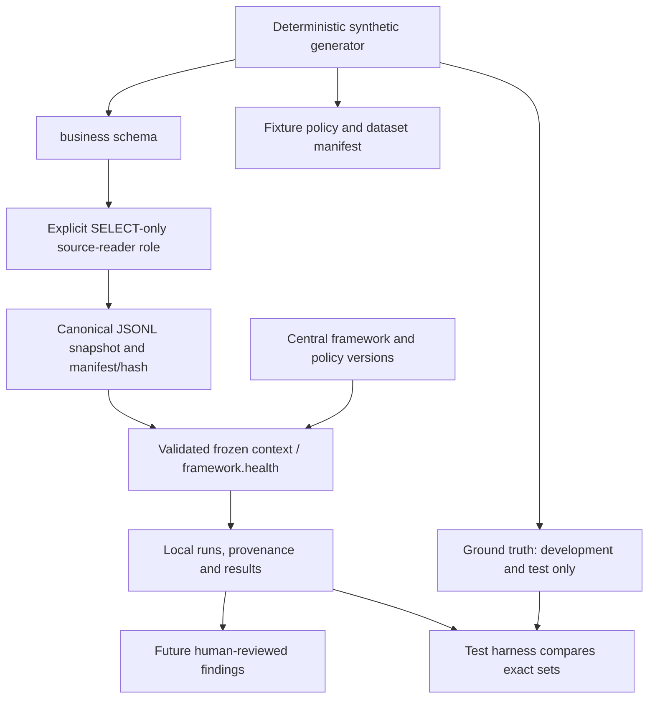
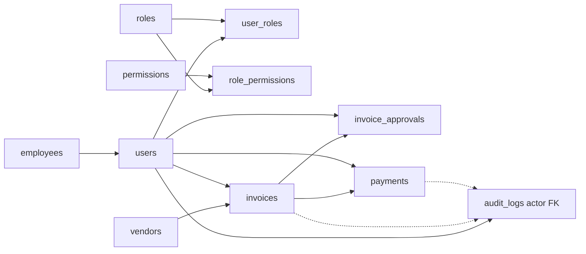

# Data lineage

Phase 1 implements synthetic generation, migrations and fixture QA. The Local CLI Audit Framework now implements restricted extraction, frozen snapshots, integrity validation, immutable context and local runs/results. PostgreSQL acceptance proves the source is unchanged. Future database results belong to audit; current results are local files, never source writes.

Source/tooling ownership: apps/api/database/generators produces apps/api/database/sample-data artifacts; apps/api/database/seeds/workflow.js writes development fixtures; apps/api/database/validation/validate.js performs fixture QA. Root scripts are command entry points to these API-owned modules. The independent audit-engine package must not import generators, fixture QA or ground truth.

Ground truth and fixture policy never flow into the current runtime. The test harness may compare independent results afterward. Framework policy version is centrally defined, with no business rules yet. Snapshot hashes identify normalized logical content; they differ from fixture-generator hashes because serialization has its own versioned contract. Neither establishes trust against an administrator who can rewrite data and hashes.

## Table relationships

| Source | Relationship / downstream meaning |
| --- | --- |
| employees → users | employee_id links employment status and effective end date to independent account state |
| users + roles → user_roles | Composite key gives unique current grants; event history explains changes |
| roles + permissions → role_permissions | Composite key expands assigned roles to granular capabilities |
| vendors + users → invoices | vendor_id identifies supplier; created_by preserves initiating account |
| invoices + users → invoice_approvals | invoice_id identifies reviewed invoice; decided_by and decided_at identify authoritative decision |
| invoices + users → payments | invoice_id identifies liability; created_by/confirmed_by preserve distinct workflow actors |
| users → audit_logs | Nullable actor_id is a structural FK |
| source entity → audit_logs | entity_type/entity_id are polymorphic snapshot references, not FKs; dotted arrows show logical lineage |

Generator UUIDs remain stable for a given version/seed/ordinal. Money is numeric(18,2) in PostgreSQL and decimal strings in artifacts. Timestamps are UTC timestamptz and ISO strings, with Asia/Jakarta used only for the fixture calendar. Per-table hashes canonicalize keys and row order, so SQL retrieval order cannot change the logical fingerprint.

Database QA independently compares the source to generated expected records. The actual CLI extraction uses the restricted role in a consistent transaction; acceptance authenticates a separate reader login and verifies all source hashes afterward. Snapshot identity/hash, primary keys, counts, UTC normalization and framework/policy/detector versions support future evidence references. The snapshot creation timestamp records local artifact creation after extraction, not a PostgreSQL transaction ID or exact source cutoff. No cross-schema evidence FKs exist. Retention is manual local filesystem retention; remote redaction, signatures and external anchoring remain open. See [snapshot/evidence contracts](AUDIT-FRAMEWORK.md) and [ADR-009](adr/ADR-009-snapshot-based-audit-execution.md).

See [ADR-002](adr/ADR-002-audit-read-only-principle.md), [ADR-005](adr/ADR-005-phase-1-dataset-conventions.md) and [verification](VERIFICATION.md).
