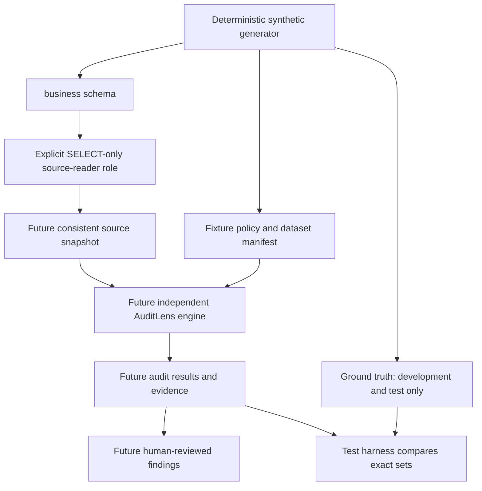
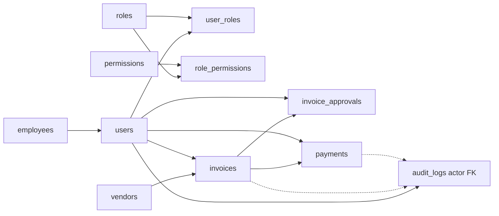

# Data lineage

Phase 1 implements the synthetic generator, source migrations, fixture artifacts and dataset QA. The source-reader permission boundary has explicit provisioning and passed actual PostgreSQL 17.5 permission tests in disposable acceptance; extraction and everything after the reader remain planned. Audit-related results/configuration belong to audit, never source tables.

Source/tooling ownership: apps/api/database/generators produces apps/api/database/sample-data artifacts; apps/api/database/seeds/workflow.js writes development fixtures; apps/api/database/validation/validate.js performs fixture QA. Root scripts are command entry points to these API-owned modules. The independent audit-engine package must not import generators, fixture QA or ground truth.

Ground truth never flows into the analysis engine. The test harness may compare independently produced outputs against the manifest after analysis. Fixture policy is separate input describing expected behavior; it contains no injected anomaly labels. Dataset hashes identify an exact generated population. They do not establish trust against a database administrator.

## Table relationships

| Source | Relationship / downstream meaning |
| --- | --- |
| employees → users | employee_id links employment status and effective end date to independent account state |
| users + roles → user_roles | Composite key gives unique current grants; event history explains changes |
| roles + permissions → role_permissions | Composite key expands assigned roles to granular capabilities |
| vendors + users → invoices | vendor_id identifies supplier; created_by preserves initiating account |
| invoices + users → invoice_approvals | invoice_id identifies reviewed invoice; decided_by and decided_at identify authoritative decision |
| invoices + users → payments | invoice_id identifies liability; created_by/confirmed_by preserve distinct workflow actors |
| users → audit_logs | Nullable actor_id is a structural FK |
| source entity → audit_logs | entity_type/entity_id are polymorphic snapshot references, not FKs; dotted arrows show logical lineage |

Generator UUIDs remain stable for a given version/seed/ordinal. Money is numeric(18,2) in PostgreSQL and decimal strings in artifacts. Timestamps are UTC timestamptz and ISO strings, with Asia/Jakarta used only for the fixture calendar. Per-table hashes canonicalize keys and row order, so SQL retrieval order cannot change the logical fingerprint.

Database QA uses one repeatable-read read-only transaction to compare a consistent population with regenerated expected records. This fixture-validation command is separate from the source-reader permission test: it uses the developer connection and does not claim actual grant enforcement. Provisioning and acceptance are in [ADR-008](adr/ADR-008-database-privilege-separation.md). Future extraction must use a separately authenticated reader login and reverify its grants, capture source IDs, dataset identity, extraction cutoff, counts, timezone and policy/test versions, and preserve evidence independently of mutable source rows. No audit-to-business foreign keys are planned. Snapshot retention, redaction and externally anchored integrity remain open.

See [ADR-002](adr/ADR-002-audit-read-only-principle.md), [ADR-005](adr/ADR-005-phase-1-dataset-conventions.md) and [verification](VERIFICATION.md).
