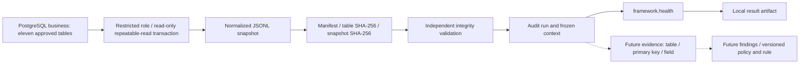

# Local CLI Audit Framework

The local framework exports a frozen population and executes only `framework.health`.
It implements no business detector, authentication, dashboard or database result writer.
See [verification](VERIFICATION.md) for executed checks and [ADR-009](adr/ADR-009-snapshot-based-audit-execution.md) for the decision.



## Repository and connection boundary

The existing editable Python `src/audit_engine` package is preserved. Models live in
`models/contracts.py`, extraction in `repositories`, the smoke check in `analyzers`,
and snapshot/execution orchestration in independent modules. `rules` remains reserved.

Python invokes a private Node transport using the already installed `pg` and `dotenv`
dependencies. This avoids adding a second PostgreSQL driver or implementing the wire
protocol. The bridge is part of the Python package data, but this milestone requires
the repository checkout, `npm ci`, Node on PATH and the editable Python install.
It is not a standalone Python wheel deployment. No API endpoint mediates extraction.

The bridge loads the repository `.env`; process variables take precedence. It prefers
`AUDIT_SOURCE_DATABASE_URL`, falling back to canonical `DATABASE_URL`. A dedicated
non-superuser login authorized to `SET ROLE auditlens_source_reader` is preferred.
The bridge ALWAYS selects that fixed role inside a read-only, repeatable-read
transaction and verifies `current_user` before reading. It never provisions roles,
changes grants, runs migrations or writes data. URL query options/fragments are
rejected. Connection and statement timeouts bound database waits; the bridge has a
180-second overall timeout. Role provisioning remains explicit administration under
[ADR-008](adr/ADR-008-database-privilege-separation.md). Existing API startup is unchanged.

The fixed column allowlist follows the current migration/data dictionary. SQL uses
explicit SELECT columns and primary-key ordering, schema-qualified business tables,
and no operator-provided identifiers or SQL. New tables/columns require a reviewed
schema version change. There are no imports of generators, fixture policy, fixture
validation or synthetic labels. Existing source event JSON remains source data;
operators must not insert evaluation labels into operational fields.

## Contracts and versions

Frozen standard-library dataclasses serialize through strict typed `from_dict` /
`from_json` readers. Unknown and missing fields are rejected. Nested mappings and
sequences become read-only mappings and tuples, including the detector context.

| Contract | Contents |
| --- | --- |
| SourceExtraction | Source type, schema version, approved table rows; private transport input |
| Snapshot | UUID, UTC creation time, source type, schema version, table manifest, logical hash; record_counts and table_hashes are derived read-only properties |
| AuditRun | UUID, lifecycle timestamps/status, framework/policy versions, snapshot ID/hash, local execution mode, detector versions and configuration |
| Provenance | Run/snapshot IDs and hash, framework/policy versions, timestamp, explicit operator and neutral local-cli environment |
| AuditContext | Validated snapshot metadata and deeply frozen normalized rows, versions and configuration; no connection or query interface |
| AuditResult | Result/run IDs, detector ID/version/configuration, policy, status, summary, count, timestamps, snapshot ID/hash and findings |
| Finding | Finding/detector/rule IDs, description, severity/confidence, entity, evidence, snapshot and run references |
| Evidence | Evidence ID, table, primary-key mapping (including composite keys), optional field, observed value and minimal context |

`versioning.py` centralizes framework `0.2.0`, snapshot schema `1`, policy
`auditlens-policy-v1` and health detector `1.0.0`. The policy is a placeholder version,
not a business rule or compliance claim. Schema/serialization changes require a schema
version bump; behavior changes require framework/detector version changes. Future
SDK validation must enforce finding/evidence referential and business semantics.

Snapshot creation precedes a run. Validated runs progress created → ready → running →
completed. `extracting` is reserved for future combined orchestration. Exceptions
after run creation record failed with completion time when storage remains writable;
invalid snapshots are rejected before allocating a run. Only run.json changes during
execution; snapshots, provenance and results use no-clobber publication. A process
crash can leave an incomplete directory or running status; there is no recovery daemon.

Operator identity is `--operator`, then process `AUDIT_OPERATOR`, then `local`.
It is an explicit short label, not authentication. No OS username, hostname, home path
or database connection metadata is captured. Unlike bridge connection settings,
AUDIT_OPERATOR is not automatically loaded from `.env` by Python.

## Canonical snapshot and integrity

Tables and object fields sort lexicographically. Rows sort by UUID primary key;
user_roles sorts by user_id/role_id and role_permissions by role_id/permission_id.
Duplicate keys and unapproved columns are rejected. JSON uses UTF-8, no ASCII escaping,
compact separators, and one LF after every JSONL row. Empty tables are zero-byte files.
Unicode text is preserved without Unicode normalization. Arrays retain source order.

Timestamps normalize to UTC ISO-8601 with exactly six fractional digits and `Z`;
naive timestamps fail. PostgreSQL timestamps are formatted before Node receives them,
preserving microseconds. Monetary NUMERIC values travel as text and normalize to
two-decimal strings, preserving numeric(18,2) precision. Event JSON is transported
as text and parsed in Python: fractional numbers become exact decimal strings,
integers remain integers, booleans/null retain their JSON types. Floats/nonfinite
numbers are rejected. These rules are specific to schema version 1.

Each table SHA-256 covers its canonical JSONL bytes. The snapshot SHA-256 covers
canonical JSON of `{source_type, schema_version, manifest}`, where manifest maps each
table to `{rows, sha256}`. Snapshot UUID, creation time, operator, run IDs, local paths
and host metadata are excluded. The manifest file itself is the Snapshot contract;
counts/hashes are not duplicated at the top level. This small deviation avoids two
competing sources of count/hash truth.

Loading independently checks exact artifact inventory, typed required metadata,
UUID identity, supported schema/source, canonical timestamp, rows/counts/order/fields,
each file hash and the aggregate hash. A modified value fails before execution.
Verified bytes are loaded once into immutable context, so analysis does not reopen
files after validation. Changing data and recomputing all hashes changes the logical
identity but cannot be detected without a separately trusted original hash.
This is integrity checking, not signing or adversary-proof storage.

Same snapshot/framework/policy/detector/configuration reproduces semantic output.
Run/result IDs and wall-clock execution timestamps intentionally differ between runs.
There is no external detector loading or arbitrary detector configuration yet.

## CLI and local files

From repository root, after existing Python editable setup and `npm ci`:

```powershell
.\audit-engine\.venv\Scripts\python.exe -m audit_engine --help
.\audit-engine\.venv\Scripts\python.exe -m audit_engine health
# Configure the dedicated reader URL in the process environment or local .env.
.\audit-engine\.venv\Scripts\python.exe -m audit_engine snapshot
.\audit-engine\.venv\Scripts\python.exe -m audit_engine snapshot inspect <snapshot-id>
.\audit-engine\.venv\Scripts\python.exe -m audit_engine run --snapshot <snapshot-id> --operator reviewer-1
.\audit-engine\.venv\Scripts\python.exe -m audit_engine result inspect <audit-run-id>
```

No arguments retains the original database-free health behavior. Optional
`--artifacts-dir <directory>` goes BEFORE the subcommand. IDs are generated internally
as canonical UUIDs; inspect/run reject traversal, absolute paths and malformed IDs.
Resolved paths must remain under the selected root and artifact links are rejected.

```text
audit-engine/artifacts/
  snapshots/<snapshot-id>/manifest.json
  snapshots/<snapshot-id>/<approved-table>.jsonl
  runs/<audit-run-id>/run.json
  runs/<audit-run-id>/provenance.json
  results/<audit-run-id>/framework.health.json
```

The default tree is Git-ignored; custom roots are the operator's responsibility.
Files are written to a temporary file, flushed/fsynced and atomically published with
a no-clobber hard link (same filesystem); run status uses atomic replacement. Parent
directories are explicitly created. Existing snapshot/run directories cause failure.
The manifest is written last as the completion marker. No retention cleanup runs
automatically. Keep only synthetic/local data, restrict the artifact directory using
OS permissions, and explicitly delete disposable artifacts when no longer needed.
Evidence should copy only fields needed to explain a future finding.

## Verification and limits

Python unittest covers contracts, immutable contexts, deterministic normalization,
tampering, path safety, failure lifecycle, CLI and static isolation. `npm run test:db`
also invokes the real Python snapshot CLI twice using the disposable reader login,
checks matching hashes, executes with unusable database URLs, inspects results,
checks credential absence and rejects tampering. Existing fixture QA independently
proves source hashes are unchanged; its labels never reach the engine.

Extraction/validation materialize the full population in memory and are intended for
the current local synthetic dataset. No streaming, signatures, external hash anchoring,
retention service, result-database persistence, sandbox for untrusted Python plugins,
authentication or remote execution is supplied. Trusted local detector code must
respect the context-only architecture; an OS-level malicious plugin sandbox is a
future concern. Reader grant drift requires renewed privilege acceptance. Railway
runtime and production reader provisioning require separate verification.

The subsequent Audit Policy + Detector SDK milestone is implemented in version 0.3.0;
see the extension below. Business detectors remain a future milestone.

## Policy-driven execution extension

Version 0.3.0 adds AuditPolicy, Detector SDK and explicit registry while preserving
these snapshot contracts and the legacy health API. See [Detector SDK](DETECTOR-SDK.md)
for the current execution lifecycle, provenance layout, partial-error semantics and
logical result hash. No business detectors are implemented.
