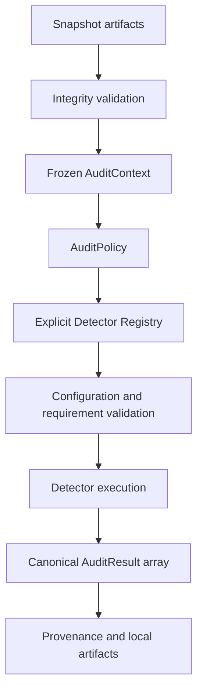

# Audit Policy and Detector SDK

Framework version: **0.3.0**. The explicit registry contains `framework.health`,
`framework.snapshot_integrity`, `business.duplicate_transaction_reference`, `business.missing_required_field`, and `business.sequence_gap`.
See [Audit Rule Pack v1](AUDIT-RULE-PACK.md) for business rule semantics.



## Audit Policy

`audit_engine.policy.AuditPolicy` is a frozen typed contract. `contract_version` versions
its JSON shape; `policy_id` and `policy_version` identify the policy itself. All fields
are required on JSON reads. Unknown fields, incorrect types, duplicate selections,
nonfinite numbers, invalid severity and out-of-range confidence are rejected.
Policy files also reject duplicate JSON keys. Confidence uses a JSON floating point
number (for example `0.0`), and is not a financial quantity. Monetary snapshot values
retain the existing exact decimal-string representation.

```json
{
  "contract_version": "1",
  "policy_id": "framework.examples",
  "policy_version": "auditlens-policy-v1",
  "name": "Framework examples",
  "description": "Framework checks only; no business audit logic.",
  "enabled_detectors": ["framework.health", "framework.snapshot_integrity"],
  "disabled_detectors": [],
  "minimum_severity": "info",
  "minimum_confidence": 0.0,
  "fail_on_detector_error": true,
  "allow_partial_results": false,
  "detector_configuration": {
    "framework.snapshot_integrity": {"emit_inventory": true}
  }
}
```

Without `--policy`, execution uses the immutable `DEFAULT_POLICY`, which is identical
to `audit-engine/policies/default.json`: health only, strict errors, info severity and
0.0 confidence. The packaged constant works independently of the current directory.
`policies/examples.json` explicitly selects both detectors and informational evidence.
Disabled IDs override enabled IDs. Every referenced ID and configuration is validated,
including disabled detectors. No effective detectors is a valid completed no-op run.
Policy descriptions and identifiers are user-supplied non-secret audit metadata.

## SDK and explicit registry

The `AuditDetector` Protocol has two methods:

```python
def metadata(self) -> DetectorMetadata: ...
def analyze(self, context: AuditContext, config: DetectorConfig) -> AuditResult: ...
```

Metadata carries `detector_id`, `detector_version`, name, description, category,
`DetectorRequirements(schema_version, required_tables)` and configuration definitions.
Identity resides in metadata, avoiding two competing detector identity sources.
`DetectorRegistry.register()` validates and captures frozen metadata, rejects duplicate
IDs, and never replaces a registration. `get(id, expected_version)` checks version and
metadata stability. `list()` sorts by ID. No imports are derived from policy text or
user paths. Only explicitly registered, reviewed repository modules are supported.

`ConfigField` supports exactly boolean, integer, optional_integer, string and list[string] values. Booleans do not count as integers. Unknown keys and incorrect types
are rejected. Defaults are deterministic; `DetectorConfig.values` is deeply frozen.
String support is used for configured snapshot table/field names. There is no
arbitrary JSON configuration, connection capability or environment interpolation.
No passwords, tokens, connection strings or other secrets belong in policy/config.

## Lifecycle and compatibility

`execute_policy(snapshot_id, root, operator, policy, registry)` first uses the existing
snapshot loader, including manifest, SHA-256, table inventory, canonical row, and
schema checks. It constructs frozen context, loads/validates policy, resolves explicit
registrations and effective configuration, and then executes in ascending detector ID.
Each detector's requirements are checked before its `analyze` method is called.
Detectors with configured inputs may implement the optional typed
`ConfiguredRequirementsDetector.requirements_for(config) -> DetectorRequirements`
hook. It receives validated frozen configuration only, returns requirements using
the existing metadata model, and must be pure and deterministic. Metadata lists the
requirements for default configuration; the hook resolves effective names. Policy
validation validates those declarations (including disabled selections), and execution
checks them against the loaded snapshot. Existing detectors retain static requirements.
This is a method on an explicitly registered trusted object, not plugin discovery.
Missing tables, missing fields and unsupported schema versions yield `skipped` results
with stable codes, not raw tracebacks. Empty-table columns are checked against the
loader's versioned schema catalog; fields are also checked on every present row.

Detectors use `result_for(metadata, context, config, summary, findings)` to construct
the existing AuditResult contract. They use empty run IDs/timestamps; the orchestrator
owns those fields. Output is decoded back through the existing contracts and checked
for detector/snapshot/policy/config identity, finding count, status, confidence and
evidence table membership. Invalid output becomes a sanitized detector error.
Thresholds filter findings; an empty filtered finding set becomes `passed`.
A summary describes the check and must not promise an unfiltered finding count.

## Error isolation

| fail_on_detector_error | allow_partial_results | Behavior after failure |
| --- | --- | --- |
| true | either | Stop calling later detectors; publish explicit `strict_failure` skips |
| false | false | Same strict behavior |
| false | true | Execute remaining compatible detectors and retain their results |

A run with any error or skip is `failed`, including partial runs. The CLI returns 1,
but all successfully computed results remain inspectable. This avoids claiming that
an incomplete audit succeeded. Strict execution preserves earlier completed evidence;
it does not roll back immutable outputs. Detector exceptions are never formatted or
persisted: only `detector_error` is recorded, including invalid output and detector-returned
error results. Infrastructure publication failures mark the run failed and use a
fixed outer error message. Exception diagnostics are intentionally absent from artifacts.

## Provenance and artifacts

Existing Snapshot, AuditRun, Provenance, AuditResult, Finding and Evidence JSON shapes
are unchanged. The legacy Python `execute()` API still returns `(run, health_result)`
and raises a sanitized ValueError on failure. Multi-detector callers use
`execute_policy()`, which returns `(run, tuple_of_results)` including failed runs.

Each `runs/<run-id>/` contains:

- `run.json`: lifecycle, snapshot ID/hash, framework/policy version, selected detector
  versions and effective configurations (including defaults).
- `provenance.json`: existing operator, UTC creation time, execution mode and snapshot linkage.
- `policy.json`: canonical complete policy, including policy ID/version; joined by run directory.
- `logical-results.json`: canonical logical content plus its SHA-256.

Each `results/<run-id>/<detector-id>.json` uses the existing AuditResult contract,
including detector identity, effective config and snapshot/run linkage. Existing
result-level config duplication is retained for backward compatibility; policy ID
and the full policy are stored once in `policy.json`. The logical content repeats the
policy as a self-contained hash input, not as a second authoritative policy record.

The existing UUID location checks, symlink rejection and atomic no-clobber publication
are retained. Run status alone is atomically replaced. Results are published by sorted
ID. `result inspect` validates identities and inventory against run metadata, returns
an object for one result (legacy behavior), an array for multiple results, and `[]`
for an explicit no-op. JSON output supports automation; run output preserves the
human-readable format and gives a process exit status.

## Determinism

Canonical JSON sorts object keys, uses compact separators, UTF-8, and rejects NaN and
Infinity. Enabled/disabled detector arrays sort lexically. Execution sorts detector IDs.
Evidence sorts by table, canonical record key, field and canonical full content.
Findings sort by severity descending, rule ID, entity type, entity ID and content hash.
Finding/evidence IDs are generated from semantic content rather than detector randomness.

The logical result SHA-256 covers snapshot logical hash, complete policy, effective
configuration, detector versions, framework version and normalized result content.
It excludes orchestrator run/result IDs, snapshot artifact IDs and execution timestamps.
The orchestrator injects no local paths or machine identity. Different run IDs, operator
labels and creation times do not affect the hash. Changed findings, evidence, detector
version or effective configuration do. The snapshot logical hash is never changed by
policy or detector choices. Missing explicit config vs an explicit default is the same
effective config, but the complete policies differ and therefore their run hashes differ.

Detector authors must keep all semantic output deterministic: no clock/random/network
inputs, machine paths, run IDs or snapshot artifact IDs inside summaries, entity IDs,
evidence or custom context. Use logical snapshot hash to refer to snapshot entities.
The SDK cannot prove arbitrary Python code deterministic. The hash is an equivalence
checksum, not a signature: it is not a tamper-proof attestation against an attacker who
can rewrite the whole artifact directory. `result inspect` does not recompute this hash.

## Security boundary

Detector arguments contain only deeply frozen snapshot data and validated configuration.
They expose no source adapter, DB connection, credential, environment, filesystem root,
or subprocess handle. Snapshot extraction remains in the separate read-only bridge.
Tests inject credential-bearing exceptions and invalid environment connection settings,
assert frozen context rejects mutation, and scan persisted artifacts for leakage.

This is an interface boundary for trusted in-process code, not an OS sandbox. Python
code could import OS/network APIs itself; external/untrusted plugins are unsupported.
A reviewed detector must never do so. Exception sanitization does not sanitize arbitrary
successful findings from a malicious module, or secrets deliberately placed in policy
text/source data. Existing source allowlists remain the data boundary. The serializable
context/config/result interface can later cross an isolated worker boundary without
introducing database access. No isolation worker is implemented in this phase.

## Create a framework detector

1. Add a reviewed repository module with stable metadata and explicit requirements.
2. Declare only needed typed configuration with deterministic defaults.
3. Implement `analyze(context, config)`; build Evidence/Finding and return `result_for`.
4. Explicitly register its instance in `DEFAULT_DETECTORS` and select it in a policy.
5. Test empty tables, incompatible schema/fields, config errors, frozen context, failure
   isolation and equivalence across reordered inputs and independent runs.
6. Bump detector version for semantic changes. Bump policy version when revising an
   established policy. Never introduce business rules under a framework detector ID.

`SnapshotIntegrityDetector` is the concrete SDK example: optional `emit_inventory`
produces one info finding with per-table row-count evidence. Validation already
happened in the loader; this detector demonstrates result production without interpreting
business risk. That framework example makes no business risk, remediation or compliance conclusion.

For example, exercise the existing detector with a validated context:

```python
from audit_engine.detectors import SnapshotIntegrityDetector, resolve_config
from audit_engine.snapshots import load_snapshot

context = load_snapshot(snapshot_id)
detector = SnapshotIntegrityDetector()
config = resolve_config(detector.metadata(), {"emit_inventory": True})
draft_result = detector.analyze(context, config)
```

This produces a draft for SDK testing. Use `execute_policy()` for production of local
audit artifacts, requirement checks, policy filtering and canonical result identities.

## CLI verification

From repository root, use `.\audit-engine\.venv\Scripts\python.exe` in place of `python`:

```powershell
python -m audit_engine
python -m audit_engine health
python -m audit_engine detectors list
python -m audit_engine detectors inspect framework.snapshot_integrity
python -m audit_engine policy validate audit-engine/policies/default.json
python -m audit_engine run --snapshot <snapshot-id> --policy audit-engine/policies/examples.json
python -m audit_engine result inspect <run-id>
python -m pytest audit-engine/tests -v
```

Install test tooling with `python -m pip install -e './audit-engine[test]'` when needed.
Production runtime dependencies are unchanged. PostgreSQL acceptance additionally runs
the two-detector policy against a real validated snapshot while source settings are invalid.

## Optional integer configuration and sequence ranges

`optional_integer` accepts exactly an integer or JSON null; booleans, strings,
floats and nested values are rejected. Null is a real unset bound, with no sentinel.
Existing types, defaults and serialized effective configurations are unchanged.
Cross-field constraints (sequence minimum <= maximum) use `requirements_for` and
fail policy validation before analysis or run artifact creation.

The existing Finding contract has no free-form content property. Sequence findings
store canonical JSON range content in the string `entity_id` (scope, start, end,
count), and repeat it in at most two boundary evidence contexts. This keeps range
content available even for empty evidence, without adding fields to old artifacts.
The executor orders this detector's findings by numeric start/end; all other
finding ordering and hash serialization stay unchanged. See the
[sequence control](AUDIT-RULE-PACK.md#sequence-control-businesssequence_gap).
